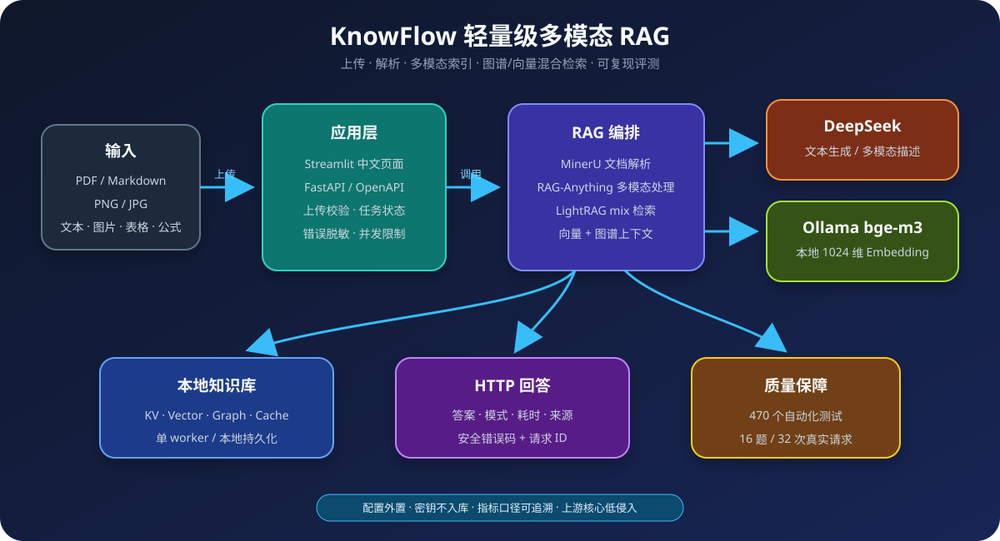
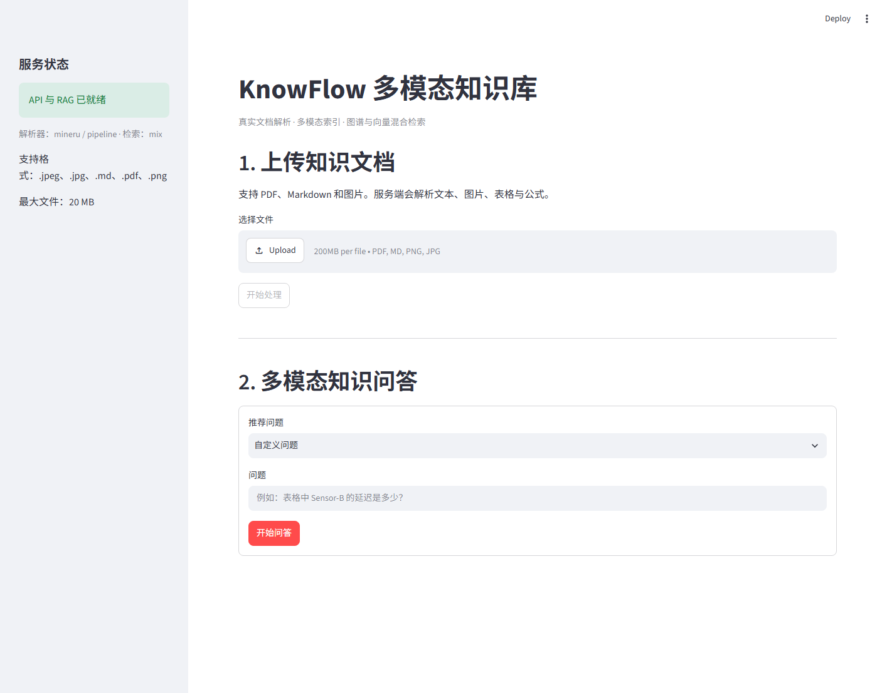
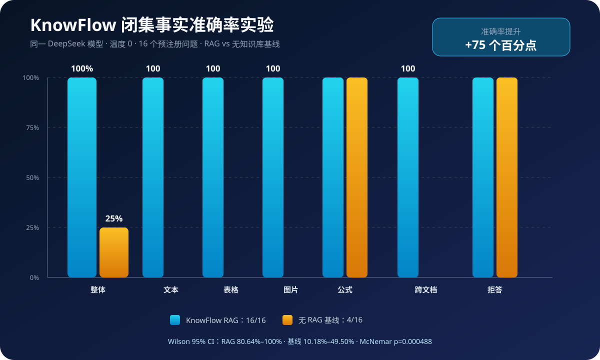

# KnowFlow：轻量级多模态 RAG

[](https://www.python.org/)
[](https://fastapi.tiangolo.com/)
[](https://streamlit.io/)
[](./report/ACCURACY_EXPERIMENT.md)

KnowFlow 是一个面向作品集和技术演示的单机多模态知识库。它在
[RAG-Anything](https://github.com/HKUDS/RAG-Anything) 与
[LightRAG](https://github.com/HKUDS/LightRAG) 之上增加了完整应用层：用户可以上传
PDF、Markdown 或图片，系统解析文本、图片、表格和公式，建立本地知识库，再通过
FastAPI 和 Streamlit 进行混合检索问答。

项目刻意保持简单：单进程、本地存储、明确的能力边界，重点展示一条可运行、可测试、
可评估的多模态 RAG 闭环，而不是包装上游的全部功能。



## 核心能力

- 支持 PDF、Markdown、PNG、JPG/JPEG 上传与后台处理状态查询。
- 统一解析和索引文本、图片、表格、公式四类内容。
- 使用 LightRAG `mix` 模式融合图谱关系与向量检索。
- 使用 DeepSeek V4.1 Flash 生成文本和多模态描述。
- 使用本地 Ollama `bge-m3` 生成 1024 维向量。
- 提供 FastAPI 接口、OpenAPI 文档和 Streamlit 中文演示页面。
- 提供上传校验、稳定错误码、请求 ID、查询限流和安全错误提示。
- 提供 16 题固定多模态回归集及一键真实 API 评测。

## 项目结果

| 项目 | 结果 |
|---|---:|
| 真实样例文档 | PDF、Markdown、PNG 共 3 份 |
| PDF 内容块 | 文本、图片、表格、公式共 7 块 |
| 固定评测集 | 16 题，覆盖 6 类场景 |
| 真实 HTTP 评测 | 2 轮，共 32 次请求 |
| 请求成功率 | 100% |
| 固定规则命中率 | 100% |
| 闭集事实准确率 | KnowFlow 100%，无 RAG 基线 25% |
| 自动化回归 | 481 passed，1 skipped |

“固定规则命中率”表示关键词、任选关键词和禁用词规则全部通过，不等同于开放领域语义
准确率。提交结果中的 131.88 ms 是已有查询缓存命中时的平均延迟，不能视为首次生成
耗时。完整口径与逐题结果见[阶段 5 评测报告](./report/PHASE_5_EVALUATION.md)。



同一 DeepSeek 模型的两轮配对消融实验共分析 64 个真实回答：KnowFlow 在 16 题闭集
事实集上的准确率为 100%，无 RAG 基线为 25%，提升 75 个百分点。该结论仅适用于提交的合成测试集，
完整方法、置信区间与显著性检验见[准确率对照实验](./report/ACCURACY_EXPERIMENT.md)。



## 目录结构

```text
KnowFlow/
├── app/                         # FastAPI、配置、Schema 和知识库服务
├── ui/                          # Streamlit 页面与安全 HTTP 客户端
├── data/
│   ├── samples/                 # 可提交的小型多模态样例
│   └── evaluation/              # 16 题固定评测集
├── examples/                    # 最小闭环和真实文档处理脚本
├── scripts/                     # 样例生成、联调和评测命令
├── tests/                       # 单元、接口、并发和可选真实集成测试
├── report/                      # 各阶段报告、交付文档与原始评测结果
├── raganything/                 # 上游 RAG-Anything 核心代码
├── environment.yml              # Conda 基础环境
└── env.example                  # 无密钥配置模板
```

应用层集中在 `app/`、`ui/` 和 `scripts/`，尽量不侵入 `raganything/` 上游核心。

## 快速启动

以下命令适用于 Ubuntu/WSL，默认使用项目根目录。

### 1. 创建 Conda 环境

```bash
conda env create --file environment.yml
conda activate raganything-dev

# CPU 环境先安装 CPU 版 PyTorch，避免拉取 CUDA 运行时
python -m pip install "torch>=2.6,<3" torchvision \
  --index-url https://download.pytorch.org/whl/cpu

python -m pip install -e ".[dev,api,ui]"
```

如果需要使用 NVIDIA GPU，可按 PyTorch 官方说明选择与本机 CUDA 匹配的安装命令，
不再执行上面的 CPU wheel 命令。

### 2. 安装并启动 Ollama

```bash
# Ubuntu/WSL 首次安装前确保存在 zstd
sudo apt-get update
sudo apt-get install -y zstd
curl -fsSL https://ollama.com/install.sh -o /tmp/install-ollama.sh
sudo sh /tmp/install-ollama.sh

ollama pull bge-m3
ollama serve
```

如果 Ollama 安装在用户目录，请确认其目录已经加入 `PATH`。`ollama serve` 需保持运行。

### 3. 配置模型

```bash
cp env.example .env
```

编辑 `.env`，至少替换：

```env
LLM_BINDING_HOST=https://api.deepseek.com
LLM_BINDING_API_KEY=你的真实密钥
LLM_MODEL=deepseek-flash
VISION_MODEL=deepseek-flash

EMBEDDING_MODEL=bge-m3
EMBEDDING_DIM=1024
EMBEDDING_BINDING_HOST=http://localhost:11434/v1
```

`.env` 已被 Git 忽略。不要把真实密钥写入 `env.example`、源码、截图或提交记录。

### 4. 启动 API 与页面

终端 1：

```bash
conda activate raganything-dev
uvicorn app.main:app --host 127.0.0.1 --port 8000 --workers 1
```

终端 2：

```bash
conda activate raganything-dev
streamlit run ui/streamlit_app.py
```

访问：

- Streamlit 页面：<http://127.0.0.1:8501>
- OpenAPI 文档：<http://127.0.0.1:8000/docs>
- 健康检查：<http://127.0.0.1:8000/health>

在页面上传 `data/samples/phase2_multimodal.pdf` 后，即可测试正文、表格、图片和公式问题。

## API

| 方法 | 路径 | 用途 |
|---|---|---|
| `GET` | `/health` | 检查 API 与 RAG 生命周期状态 |
| `GET` | `/config/public` | 获取不含密钥的公开配置 |
| `POST` | `/documents` | 上传并异步处理一份文档 |
| `GET` | `/documents/{task_id}` | 查询文档任务状态 |
| `POST` | `/query` | 执行 `mix` 模式知识库问答 |

查询示例：

```bash
curl -X POST http://127.0.0.1:8000/query \
  -H 'Content-Type: application/json' \
  -d '{"question":"表格中 Sensor-B 的延迟是多少？"}'
```

接口错误统一返回安全错误码、用户提示和请求 ID，不向客户端泄露密钥、服务器路径或
完整异常栈。

## 构建可复现样例知识库

仓库提交了小型输入文件，但不会提交解析输出和本地向量/图谱存储。执行：

```bash
python scripts/generate_phase2_samples.py
python examples/process_real_documents.py --validate-only
python examples/process_real_documents.py
```

真实处理会调用 DeepSeek 与 Ollama，并生成被 Git 忽略的 `rag_storage_phase2/` 和
`output_phase2/`。随后让 API 复用该知识库：

```bash
WORKING_DIR=./rag_storage_phase2 \
  uvicorn app.main:app --host 127.0.0.1 --port 8000 --workers 1
```

## 测试与评测

默认全量测试不会主动调用真实模型：

```bash
python -m pytest -q
python -m ruff check app ui scripts tests
```

真实集成测试必须显式开启，并要求 `.env`、Ollama 和阶段 2 知识库已经就绪：

```bash
RUN_REAL_INTEGRATION=1 python -m pytest -m integration
```

对已启动且使用 `rag_storage_phase2` 的 API 执行两轮固定评测：

```bash
python -m scripts.evaluate \
  --api-url http://127.0.0.1:8000 \
  --rounds 2 \
  --fail-on-check
```

结果默认写入 `report/artifacts/phase5_results.json`。该文件包含数据集哈希、模型名称、
逐题回答、分类命中率及 P50/P95 延迟，但不包含密钥或 API 地址。

## 设计取舍

- **单 worker**：本地 LightRAG 存储与内存任务表不适合多进程共享。
- **本地存储**：降低部署复杂度，适合演示和学习，不定位为生产集群。
- **后台任务**：上传接口立即返回任务 ID，但任务状态随进程重启丢失。
- **查询限流**：信号量限制模型并发，文档解析则串行执行。
- **来源字段**：当前 LightRAG 链路尚未稳定返回结构化引用，因此允许 `sources=[]`，
  页面会明确提示，不从回答字符串中猜测来源。
- **缓存指标分离**：重复查询延迟与首次生成延迟分别说明，避免性能数字失真。

## 已知限制与后续方向

- 当前适合单机演示，不支持多租户、权限控制和分布式任务。
- MinerU 首次运行可能下载模型，PDF 解析时间与机器性能相关。
- 固定评测集较小且来自合成样例，不能代表开放领域效果。
- 关键词规则不能替代人工评审、召回率或引用准确率评测。
- 后续可引入 Redis/Celery、外部向量库、可追溯引用和 LLM-as-a-judge。

## 项目文档

- [开发计划](./report/DEVELOPMENT_PLAN.md)
- [完整开发文档](./report/DEVELOPMENT_GUIDE.md)
- [阶段 2：真实文档处理](./report/PHASE_2_RESULT.md)
- [阶段 3：FastAPI 服务](./report/PHASE_3_RESULT.md)
- [阶段 4：Streamlit 页面](./report/PHASE_4_RESULT.md)
- [阶段 5：测试与评估](./report/PHASE_5_EVALUATION.md)
- [阶段 6：交付报告](./report/PHASE_6_DELIVERY.md)
- [RAG 准确率对照实验](./report/ACCURACY_EXPERIMENT.md)
- [简历与面试讲解稿](./report/RESUME_AND_INTERVIEW.md)

## 上游与许可

KnowFlow 基于 HKUDS 的 [RAG-Anything](https://github.com/HKUDS/RAG-Anything) 二次开发，
保留其 `raganything/` 核心代码、许可和相关文档。此仓库新增的应用层主要用于个人学习、
作品集展示和工程实践。项目遵循仓库中的 [MIT License](./LICENSE)。
